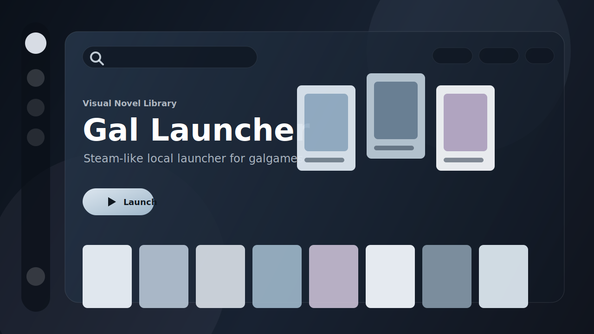

<p align="center">
  
</p>

<h1 align="center">Gal Launcher</h1>

<p align="center">
  A Steam-like local launcher for Galgame and visual novels.
  <br>
  像 Steam 一样管理本地 Galgame / 视觉小说。
</p>

<p align="center">
  <a href="https://github.com/KamiNeko-pre/gal-launcher/releases"><strong>Download</strong></a>
  ·
  <a href="docs/USER_GUIDE.md">User Guide</a>
  ·
  <a href="ROADMAP.md">Roadmap</a>
  ·
  <a href="docs/DATA_SOURCES.md">Data Sources</a>
</p>

<p align="center">
  
  
  
  
</p>

> Gal Launcher does **not** provide games, downloads, cracks, or DRM bypass tools. It only manages games already installed on your own computer.
>
> 本项目不提供游戏本体、不提供下载资源、不提供破解。它只是一个本地游戏库管理工具。

## Why

Many visual novels live in folders named `game.exe`, `start.exe`, or `SiglusEngine.exe`. After a while, it becomes hard to remember what each folder is, what you have played, and where the right launcher is.

Gal Launcher turns those folders into a clean local library:

- cover wall for browsing
- key visual launch page
- one-click launch
- play count and play time tracking
- metadata, cover, background, and rating lookup
- local backup and restore

## Download

Go to [Releases](https://github.com/KamiNeko-pre/gal-launcher/releases) and download:

```text
Gal Launcher.exe
```

Double-click to run.

Windows may show an "Unknown publisher" warning because the current public build is unsigned. If you downloaded it from this repository's Release page, choose continue/run.

## Features

- Steam-like cover wall
- Immersive horizontal key visual launch page
- Add `.exe`, `.bat`, `.cmd`, and `.lnk` launch files
- Track recent play time, total play time, and launch count
- Search title, developer, release date, description, cover, and background candidates
- Bangumi rating lookup
- Manual metadata editing
- Backup export/import
- Local-first storage

## Quick Start

1. Open `Gal Launcher.exe`
2. Click the `+` button
3. Choose the game's launch file
4. Let the app search metadata
5. Pick the correct metadata/cover if needed
6. Click a cover to enter the launch page

Common launch files:

```text
game.exe
start.exe
launcher.exe
SiglusEngine.exe
*.bat
*.cmd
*.lnk
```

Read the full [User Guide](docs/USER_GUIDE.md).

## Data And Privacy

Your library is stored locally, usually here:

```text
%APPDATA%\gal-launcher\library
```

This may include game paths, cached covers, cached backgrounds, metadata, and play records.

Metadata search features may send search keywords to third-party services such as VNDB, Steam, or Bangumi. See [Privacy](docs/PRIVACY.md) and [Data Sources](docs/DATA_SOURCES.md).

## Screenshots

Real screenshots are intentionally not bundled yet because many covers and backgrounds are copyrighted by their original owners. The preview image above is a synthetic mockup made for this README.

If you share screenshots, please make sure you have the right to share the artwork shown in them.

## For Developers

Requirements:

- Windows
- Node.js
- npm

Run locally:

```bash
npm install
npm run dev
```

Build:

```bash
npm run build
```

Package unpacked Windows app:

```bash
npm run dist
```

Package portable exe:

```bash
npm run dist:portable
```

## Roadmap

See [ROADMAP.md](ROADMAP.md).

## Contributing

Issues and suggestions are welcome.

Please do not upload game files, downloaded covers/backgrounds, or personal library data. See [CONTRIBUTING.md](CONTRIBUTING.md).

## License

MIT. See [LICENSE](LICENSE).
