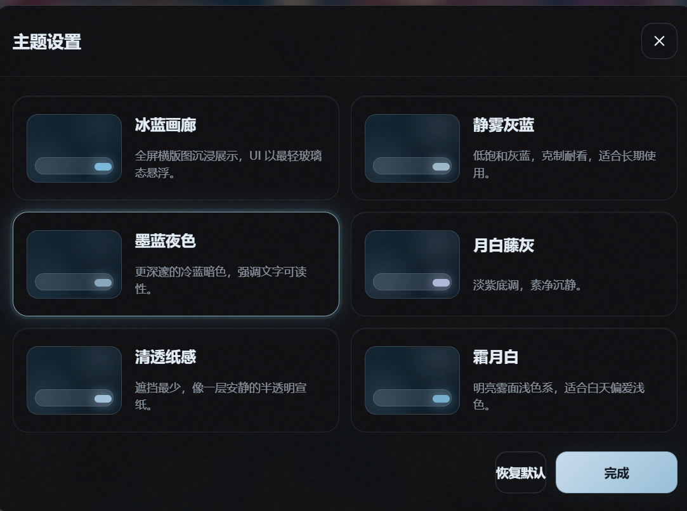

<p align="center">
  
</p>

<h1 align="center">✨ Gal Launcher</h1>

<p align="center">
  <strong>让本地 Galgame 库也拥有 Steam 级的封面墙和沉浸启动体验。</strong>
  <br>
  <sub>A Steam-style launcher for your local visual novel library — browse, launch, track.</sub>
</p>

<p align="center">
  <a href="https://github.com/KamiNeko-pre/gal-launcher/releases"><strong>⬇️ 下载 Download</strong></a>
  ·
  <a href="docs/USER_GUIDE.md">📖 使用教程</a>
  ·
  <a href="ROADMAP.md">🗺️ 路线图</a>
  ·
  <a href="docs/DATA_SOURCES.md">📡 数据来源</a>
</p>

<p align="center">
  
  
  
  
  
</p>

> **Disclaimer / 免责声明**：Gal Launcher 不提供游戏本体、下载资源、破解或 DRM 绕过工具。它只管理你已安装到本地的游戏。This project does NOT provide games, downloads, cracks, or DRM bypass tools.

---

## 🤔 这到底是什么？

硬盘里一堆 `game.exe`、`SiglusEngine.exe`、`start.exe`……久而久之根本分不清哪个文件夹是哪部作品，想重温也找不到入口。

Gal Launcher 把那些文件夹变成**一张封面墙**：

- 🎮 给每个游戏匹配封面和背景图
- 🖼️ 横版全屏启动页 + 毛玻璃悬浮 UI
- ⚡ 一键启动，自动追踪游戏时长
- 📡 从 VNDB / Bangumi / Steam 等 7 个来源搜刮资料和封面
- 🔒 数据全存本地，不依赖任何云服务

**本质上就是一个「本地 Galgame 的 Steam 库」。**

---

## 🎨 功能亮点

<table>
<tr>
  <td width="50%">
    <h4>🖼️ 封面墙浏览</h4>
    <p>竖版封面横向滚动，3D 悬浮效果，和 Steam 库一样的浏览体验。</p>
  </td>
  <td width="50%">
    <h4>🎮 沉浸启动页</h4>
    <p>横版全屏背景 + 毛玻璃悬浮 UI + 一键启动，仪式感拉满。</p>
  </td>
</tr>
<tr>
  <td>
    <h4>📡 多源资料搜索</h4>
    <p>VNDB 搜资料 + Bangumi 查评分 + Steam / DLsite / 2DFan 等 7 源搜封面。</p>
  </td>
  <td>
    <h4>⏱️ 游玩追踪</h4>
    <p>自动记录启动次数、总时长、最近 2 周时长、游玩记录历史。</p>
  </td>
</tr>
<tr>
  <td>
    <h4>🎨 6 套毛玻璃主题</h4>
    <p>冰蓝画廊 · 静雾灰蓝 · 墨蓝夜色 · 月白藤灰 · 清透纸感 · 霜月白</p>
  </td>
  <td>
    <h4>🔒 本地优先</h4>
    <p>数据全存本地 JSON。离线照常用，崩溃不丢数据。一键备份/恢复。</p>
  </td>
</tr>
</table>

---

## 🎨 主题预览

<p align="center">
  
</p>

| 主题 | 风格 |
|------|------|
| **冰蓝画廊** | 默认主题，全屏沉浸，冷蓝玻璃态 |
| **静雾灰蓝** | 低饱和克制，适合长期使用 |
| **墨蓝夜色** | 更深邃冷蓝，文字更突出 |
| **月白藤灰** | 淡紫底调，素净沉静 |
| **清透纸感** | 最少遮挡，像半透明宣纸 |
| **霜月白** | 明亮浅色系，白天舒适 |

---

## ⚡ 快速开始

```
1. 下载 Gal-Launcher-vX.X.X.zip → 解压 → 双击 Gal Launcher.exe
2. 点左下角 + 按钮 → 选游戏启动文件
3. 等待自动搜索资料和封面（几秒钟）
4. 点封面进入启动页 → 一键启动
```

支持 `exe / bat / cmd / lnk` 四种启动方式。执行目录会自动设为游戏所在文件夹，兼容性不用担心。

> 📖 完整教程：[使用指南](docs/USER_GUIDE.md)

---

## 📸 截图画廊

<p align="center">
  
  <br>
  <em>横版全屏启动页 + 毛玻璃悬浮 UI</em>
</p>

<p align="center">
  
  <br>
  <em>游戏详情面板：时长统计 + 资料完整度 + 游玩记录</em>
</p>

<p align="center">
  
  <br>
  <em>7 源并行的封面候选搜索</em>
</p>

> 截图内封面为渐变占位图，以规避版权问题。实际使用中会显示真实封面。

---

## 📡 数据来源

| 来源 | 用途 | 类型 |
|------|------|------|
| 🔵 VNDB | 游戏资料、开发商、发行日 | API |
| 🟠 Bangumi | 评分查询、封面候选 | API + 网页 |
| 🟢 Steam | 封面候选 | API |
| 🔴 DLsite | 封面候选 | 网页 |
| 🟣 2DFan | 封面候选 | 网页 |
| 🟡 Lzacg | 封面候选 | 网页 |
| ⚪ 官网 | 封面候选 | 网页爬取 |

详见 [数据来源说明](docs/DATA_SOURCES.md) 和 [隐私说明](docs/PRIVACY.md)。

---

## 📊 对比

| | Gal Launcher | Playnite | Steam | 手动管理 |
|------|:---:|:---:|:---:|:---:|
| Galgame 资料搜索 | ✅ VNDB | ❌ | ❌ | ❌ |
| Bangumi 评分 | ✅ | ❌ | ❌ | ❌ |
| 7 源封面搜索 | ✅ | ❌ | ❌ | ❌ |
| 毛玻璃主题 | ✅ 6套 | ❌ | ❌ | ❌ |
| 本地离线可用 | ✅ | ❌ | ❌ | ✅ |
| 开源免费 | ✅ MIT | ✅ MIT | ❌ | ✅ |

---

## 🔧 开发

```bash
# 环境要求：Windows + Node.js + npm

npm install        # 安装依赖
npm run dev        # 启动开发服务器（Vite + Electron）
npm run build      # 生产构建
npm run dist       # 打包解压版
npm run dist:portable  # 打包单文件 portable exe
```

技术栈：Electron 38 · React 19 · TypeScript 5.8 · Vite 7 · 纯 CSS 变量（无 UI 框架）

---

## 🗺️ 路线图

见 [ROADMAP.md](ROADMAP.md) — 近期计划包括 GIF 演示、集合视图增强、自动备份。

---

## 🤝 参与贡献

欢迎提 Issue 和 PR。注意不要上传游戏文件、封面图片、个人库数据。

详见 [CONTRIBUTING.md](CONTRIBUTING.md) · [行为准则](CODE_OF_CONDUCT.md)

---

## 📄 License

MIT © 2026 Gal Launcher

<p align="center">
  <sub>如果你觉得这个项目有用，请给一个 ⭐ Star 支持一下~</sub>
  <br>
  <sub>觉得好用的话，欢迎在 VNDB / Bangumi / 其乐 / 绯月 分享给更多人 🙏</sub>
</p>
