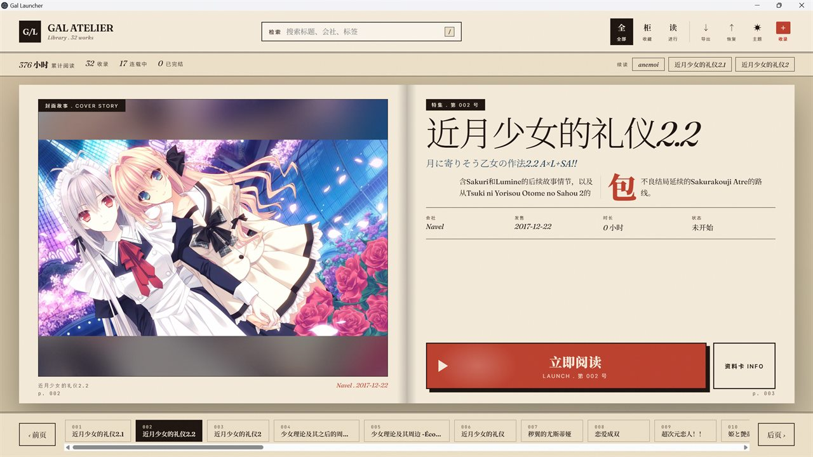
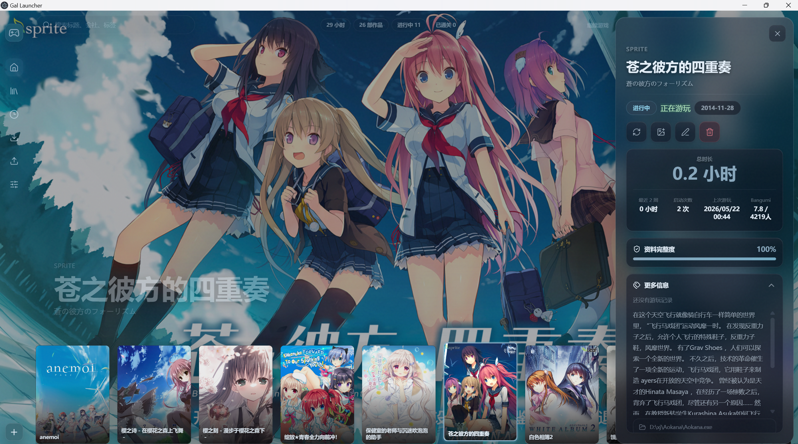

<p align="center">
  
</p>

<h1 align="center">Gal Launcher</h1>

<p align="center">
  <strong>璁╂湰鍦?Galgame / 瑙嗚灏忚鏀惰棌涔熸嫢鏈夋紓浜€佸彲杩借釜銆佸彲鍒囨崲涓婚鐨勫惎鍔ㄤ綋楠屻€?/strong>
  <br>
  <sub>A local visual novel launcher for browsing, launching, tracking, and presenting your library.</sub>
</p>

<p align="center">
  <a href="https://github.com/KamiNeko-pre/gal-launcher/releases"><strong>涓嬭浇 Download</strong></a>
  路
  <a href="docs/USER_GUIDE.md">浣跨敤鏁欑▼</a>
  路
  <a href="ROADMAP.md">璺嚎鍥?/a>
  路
  <a href="docs/DATA_SOURCES.md">鏁版嵁鏉ユ簮</a>
</p>

<p align="center">
  
  
  
  
  
</p>

> **鍏嶈矗澹版槑 / Disclaimer**锛欸al Launcher 涓嶆彁渚涙父鎴忔湰浣撱€佷笅杞借祫婧愩€佺牬瑙ｃ€佽ˉ涓佹垨 DRM 缁曡繃宸ュ叿銆傚畠鍙鐞嗕綘宸茬粡瀹夎鍦ㄦ湰鍦扮殑娓告垙銆?
---

## 杩欏埌搴曟槸浠€涔堬紵

纭洏閲屼竴鍫?`game.exe`銆乣SiglusEngine.exe`銆乣start.exe`銆乣launcher.exe`锛屾椂闂翠竴涔呭氨寰堥毦鍒嗘竻鍝釜鏂囦欢澶规槸鍝儴浣滃搧锛屾兂閲嶆俯涔熸壘涓嶅埌鍏ュ彛銆?
Gal Launcher 鎶婅繖浜涙湰鍦版父鎴忔暣鐞嗘垚涓€涓瑙夊皬璇翠笓鐢ㄥ惎鍔ㄥ櫒锛?
- 缁欐瘡涓父鎴忓尮閰嶅皝闈€佹í鐗堣儗鏅€佷細绀俱€佸彂鍞棩銆佹爣绛惧拰绠€浠?- 浠?VNDB / Bangumi / Steam 绛夊涓潵婧愯緟鍔╂悳绱㈣祫鏂欏拰鍥剧墖鍊欓€?- 鐢ㄥ濂椾富棰樺睍绀轰綔鍝佸簱锛岃€屼笉鏄彧鏄剧ず鏂囦欢璺緞
- 涓€閿惎鍔ㄦ父鎴忥紝骞惰嚜鍔ㄨ褰曞惎鍔ㄦ鏁板拰娓哥帺鏃堕暱
- 鏁版嵁淇濆瓨鍦ㄦ湰鍦帮紝鏀寔瀵煎嚭澶囦唤鍜屾仮澶?
鏈川涓婏紝瀹冩槸涓€涓€滄湰鍦?Galgame / 瑙嗚灏忚涔︽灦鈥濄€?
---

## 鍔熻兘浜偣

<table>
<tr>
  <td width="50%">
    <h4>鏈湴娓告垙搴?/h4>
    <p>娣诲姞 <code>.exe</code>銆?code>.bat</code>銆?code>.cmd</code>銆?code>.lnk</code> 鍚姩鏂囦欢锛岃嚜鍔ㄨ缃伐浣滅洰褰曞苟鍚姩娓告垙銆?/p>
  </td>
  <td width="50%">
    <h4>璧勬枡琛ュ叏</h4>
    <p>鎼滅储鏍囬銆佸師鍚嶃€佷細绀俱€佺畝浠嬨€佸彂鍞棩銆佹爣绛俱€佽瘎鍒嗗拰鍥剧墖鍊欓€夛紝鑷姩璇嗗埆涓嶅噯鏃朵篃鍙互鎵嬪姩淇銆?/p>
  </td>
</tr>
<tr>
  <td>
    <h4>灏侀潰涓庢í鐗堣儗鏅?/h4>
    <p>绔栫増灏侀潰鐢ㄤ簬涔︽灦鍜屾敹钘忛〉锛屾í鐗堝浘鐢ㄤ簬鍚姩椤点€傚彲浠ヤ粠鍊欓€夐噷閫夛紝涔熷彲浠ヤ娇鐢ㄦ湰鍦板浘鐗囥€?/p>
  </td>
  <td>
    <h4>娓哥帺杩借釜</h4>
    <p>璁板綍鍚姩娆℃暟銆佹€绘椂闀裤€佹渶杩戞父鐜╂椂闂淬€佸綋鍓嶈繘琛岀姸鎬佸拰浼氳瘽鍘嗗彶銆?/p>
  </td>
</tr>
<tr>
  <td>
    <h4>澶氫富棰樼晫闈?/h4>
    <p>鍏涓婚鎷ユ湁涓嶅悓甯冨眬銆佸鑸拰鏀惰棌椤碉紝涓嶅彧鏄崲棰滆壊銆?/p>
  </td>
  <td>
    <h4>鏈湴浼樺厛</h4>
    <p>娓告垙搴撴暟鎹繚瀛樺湪鏈満銆傛敮鎸佸浠藉鍑哄拰鎭㈠锛屼笉渚濊禆浜戝悓姝ャ€?/p>
  </td>
</tr>
</table>

---

## 涓婚绯荤粺

0.3.0 涔嬪悗锛屼富棰樹笉鍐嶅彧鏄厤鑹查璁撅紝鑰屾槸瀹屾暣鐨勫墠绔竷灞€銆傛瘡濂椾富棰橀兘鏈夎嚜宸辩殑淇℃伅鏋舵瀯銆佷綔鍝佸鑸拰鏀惰棌椤佃〃杈俱€?
| 涓婚 | 椋庢牸 |
| --- | --- |
| **Cinema** | 娌夋蹈寮忔í鐗堝ぇ鍥撅紝淇濈暀鏈€鍒濈殑鐢靛奖鎰熷惎鍔ㄨ瑷€ |
| **Editorial** | 鏉傚織璺ㄩ〉銆佸垔澶村伐鍏锋爮銆佺洰褰曞紡鍒嗛〉 |
| **Arcade** | CRT 娓告垙鏈恒€佸崱甯︽Ы銆佸儚绱?HUD銆佽鏈哄惎鍔ㄦ寜閽?|
| **Atelier** | 鎵嬭处妗岄潰銆佺浉鍐屻€佷究绛惧拰绾稿紶鎷艰创 |
| **Lumen Shelf** | 鏄庝寒涔︽灦銆佺洰褰曠储寮曘€佸鍒椾綔鍝佸 |
| **Aurora** | 鏌斿厜鍓х収鑸炲彴銆佺画璇诲垪琛ㄥ拰鐜荤拑淇℃伅鍗?|

<table>
<tr>
  <td width="50%"><br><strong>Cinema</strong></td>
  <td width="50%"><br><strong>Editorial</strong></td>
</tr>
<tr>
  <td width="50%"><br><strong>Arcade</strong></td>
  <td width="50%"><br><strong>Atelier</strong></td>
</tr>
<tr>
  <td width="50%"><br><strong>Lumen Shelf</strong></td>
  <td width="50%"><br><strong>Aurora</strong></td>
</tr>
</table>

---

## 蹇€熷紑濮?
```text
1. 涓嬭浇 Gal-Launcher-vX.X.X.zip
2. 瑙ｅ帇鍚庢墦寮€ Gal Launcher.exe
3. 鐐瑰嚮娣诲姞鎸夐挳锛岄€夋嫨娓告垙鍚姩鏂囦欢
4. 绛夊緟鑷姩璧勬枡鎼滅储锛屾垨鎵嬪姩閫夋嫨鍊欓€夎祫鏂?5. 鐐瑰嚮灏侀潰杩涘叆鍚姩椤碉紝涓€閿惎鍔ㄦ父鎴?```

鏀寔 `exe / bat / cmd / lnk` 鍥涚鍚姩鏂瑰紡銆傛墽琛岀洰褰曚細鑷姩璁句负娓告垙鎵€鍦ㄦ枃浠跺す銆?
瀹屾暣鏁欑▼瑙?[浣跨敤鎸囧崡](docs/USER_GUIDE.md)銆?
---

## 鎴浘鐢诲粖

<p align="center">
  
  <br>
  <em>妯増涓昏瑙夊惎鍔ㄩ〉</em>
</p>

<p align="center">
  
  <br>
  <em>娓告垙璇︽儏闈㈡澘锛氳祫鏂欍€佹椂闀跨粺璁″拰娓哥帺璁板綍</em>
</p>

<p align="center">
  
  <br>
  <em>灏侀潰鍜岃儗鏅€欓€夋悳绱?/em>
</p>

---

## 涓嬭浇涓庤繍琛?
鍓嶅線 [Releases](https://github.com/KamiNeko-pre/gal-launcher/releases) 涓嬭浇鏈€鏂扮増鏈€?
鎺ㄨ崘涓嬭浇 zip 鍖咃紝瑙ｅ帇鍚庤繍琛岋細

```text
win-unpacked/Gal Launcher.exe
```

濡傛灉 Windows 鎻愮ず鈥滄湭鐭ュ彂甯冭€呪€濓紝杩欐槸鍥犱负褰撳墠鐗堟湰娌℃湁浠ｇ爜绛惧悕璇佷功銆傜‘璁ゆ枃浠舵潵鑷湰浠撳簱 Release 鍚庣户缁繍琛屽嵆鍙€?
---

## 鏁版嵁鏉ユ簮

| 鏉ユ簮 | 鐢ㄩ€?| 绫诲瀷 |
| --- | --- | --- |
| VNDB | 娓告垙璧勬枡銆佷細绀俱€佸彂琛屾棩銆佸皝闈㈠拰鎴浘鍊欓€?| API |
| Bangumi | 鏉＄洰鎼滅储銆佽瘎鍒嗐€佸皝闈㈠€欓€?| API / 缃戦〉 |
| Steam | 鍟嗗簵鍥剧墖鍊欓€?| API |
| DLsite | 鍥剧墖鍊欓€?| 缃戦〉 |
| 2DFan | 鍥剧墖鍊欓€?| 缃戦〉 |
| 鍏朵粬绀惧尯椤甸潰 | 鍙€夎ˉ鍏呭€欓€?| 缃戦〉 |
| 鏈湴鏂囦欢 | 鐢ㄦ埛鎵嬪姩閫夋嫨鐨勫皝闈㈠拰鑳屾櫙 | 鏈満 |

璇﹁ [鏁版嵁鏉ユ簮璇存槑](docs/DATA_SOURCES.md) 鍜?[闅愮璇存槑](docs/PRIVACY.md)銆?
---

## 瀵规瘮

| | Gal Launcher | Playnite | Steam | 鎵嬪姩绠＄悊 |
| --- | :---: | :---: | :---: | :---: |
| Galgame / 瑙嗚灏忚璧勬枡鎼滅储 | 鏄?| 鎻掍欢渚濊禆 | 鍚?| 鍚?|
| Bangumi 璇勫垎 | 鏄?| 鍚?| 鍚?| 鍚?|
| 澶氭潵婧愬浘鐗囧€欓€?| 鏄?| 鎻掍欢渚濊禆 | 鍚?| 鍚?|
| 涓撻棬涓鸿瑙夊皬璇磋璁＄殑涓婚 | 鏄?| 鍚?| 鍚?| 鍚?|
| 鏈湴绂荤嚎鍙敤 | 鏄?| 鏄?| 閮ㄥ垎 | 鏄?|
| 寮€婧愬厤璐?| 鏄?| 鏄?| 鍚?| 鏄?|

---

## 寮€鍙?
```powershell
npm install
npm run dev
npm run build
```

蹇€熸墦鍖呭鏍哥増鏈細

```powershell
Stop-Process -Name "Gal Launcher" -Force -ErrorAction SilentlyContinue
Start-Sleep -Seconds 1
npm run dist
```

浜х墿璺緞锛?
```text
release/win-unpacked/Gal Launcher.exe
```

甯歌瀹℃牳涓嶉渶瑕佽窇 `npm run dist:portable`銆俻ortable 鍗曟枃浠朵細鎶?Electron 杩愯鏃跺帇鎴愪竴涓?exe锛岃€楁椂鏄庢樉鏇翠箙銆?
鎶€鏈爤锛欵lectron 38銆丷eact 19銆乀ypeScript 5.9銆乂ite 7銆乴ucide-react銆佺函 CSS 涓婚灞傘€?
---

## 璺嚎鍥?
瑙?[ROADMAP.md](ROADMAP.md)銆傝繎鏈熸柟鍚戝寘鎷富棰樼ǔ瀹氭€с€佹敹钘忛〉浣撻獙銆佹€ц兘浼樺寲鍜岃祫鏂欐簮鍙淮鎶ゆ€с€?
---

## 鍙備笌璐＄尞

娆㈣繋鎻?Issue 鍜?PR銆傝涓嶈涓婁紶娓告垙鏂囦欢銆佷笅杞藉皝闈€佷釜浜哄簱鏁版嵁鎴栨湰鍦扮紦瀛樸€?
璇﹁ [CONTRIBUTING.md](CONTRIBUTING.md) 鍜?[琛屼负鍑嗗垯](CODE_OF_CONDUCT.md)銆?
---

## License

MIT 漏 2026 Gal Launcher

