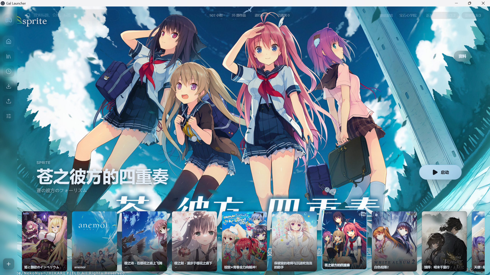
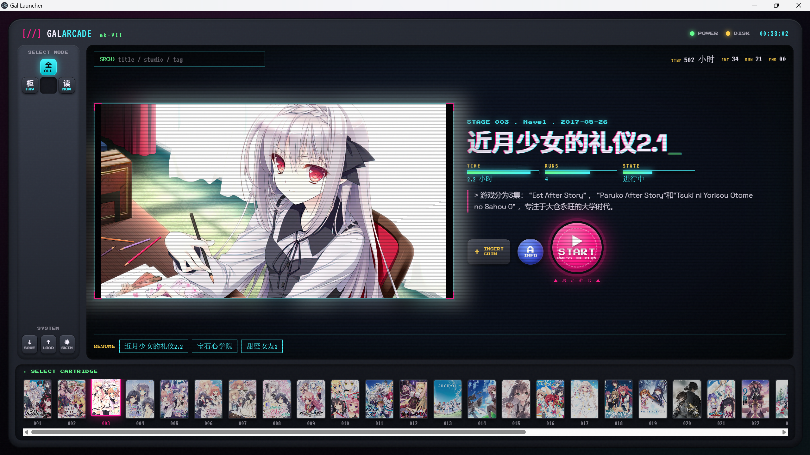
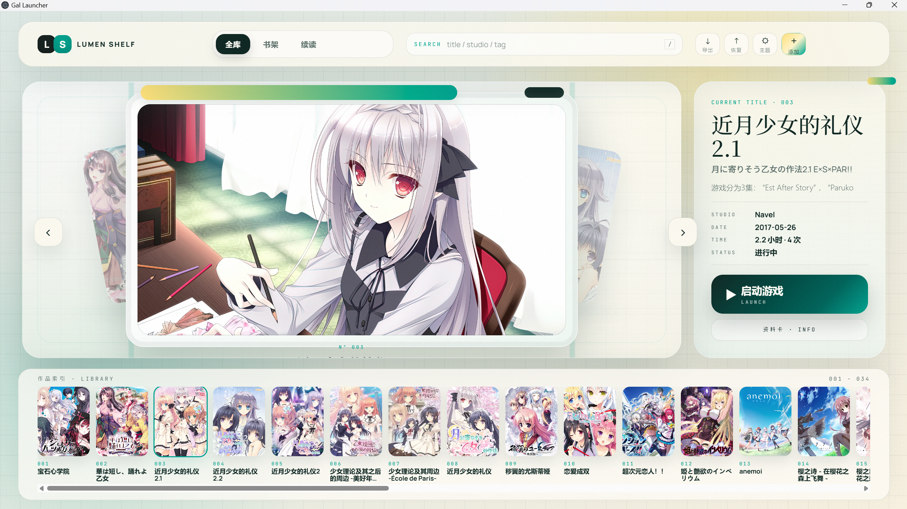
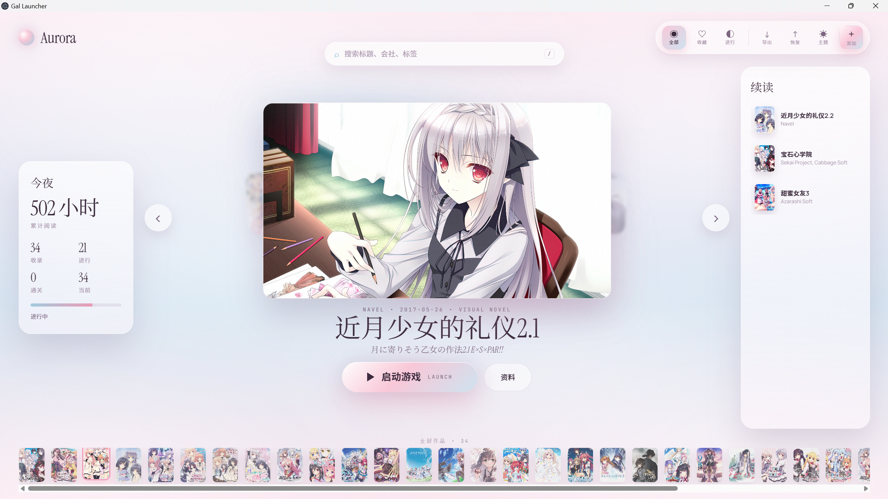

# Gal Launcher

面向 Windows 的本地 Galgame / 视觉小说启动器。把散落在硬盘里的作品整理成游戏库，补全资料与封面，记录游玩情况。

[下载发行版](https://github.com/KamiNeko-pre/gal-launcher/releases) · [使用指南](docs/USER_GUIDE.md) · [更新记录](CHANGELOG.md) · [问题反馈](https://github.com/KamiNeko-pre/gal-launcher/issues)

## 功能

- **管理本地游戏**：添加 `.exe`、`.bat`、`.cmd` 或 `.lnk` 启动文件，从游戏库直接启动。
- **补全作品资料**：搜索标题、原名、会社、发售日、简介和 Bangumi 评分；支持手动修正。
- **选择封面和背景**：搜索多个来源的图片候选，也可以使用本地图片。
- **记录游玩情况**：查看启动次数、总时长、最近游玩时间和会话历史。
- **切换界面主题**：六套主题提供不同的作品导航和游戏库布局。
- **批量收录游戏**：选择一个总目录，自动识别其中第一层游戏文件夹和启动 EXE。
- **分类与排序**：自建分类、批量整理，在主页和书架切换分类范围，按标题、游玩时长等排序。
- **沉浸模式与手柄**：全屏浏览、切换作品，打开资料、书架和主题。
- **转区与超分**：按游戏启用 Locale Emulator 或 Magpie；支持选择已有程序或从官方来源下载部署。
- **备份游戏库**：数据保存在本机，支持导出和恢复。

## 下载与使用

1. 打开 [Releases](https://github.com/KamiNeko-pre/gal-launcher/releases)，选择发行版附件，不是 GitHub 自动生成的源码压缩包。
2. 单文件 EXE 可直接运行，无需手动解压；ZIP 完整解压后运行其中的 `Gal Launcher.exe`。ZIP 是完整目录版，必须保留 EXE 同目录下的资源文件。
3. 在应用中添加游戏启动文件，确认作品资料和图片，然后点击启动。

本地游戏管理和启动不需要联网；在线资料、评分和图片搜索需要网络连接。当前版本未签名，Windows 可能显示未知发布者提示，请核对下载来源。

更多操作及常见问题见 [使用指南](docs/USER_GUIDE.md)。

## 界面主题

| 主题 | 界面特点 |
| --- | --- |
| Cinema | 横版大图与沉浸式启动页 |
| Editorial | 杂志跨页与目录式导航 |
| Arcade | CRT、卡带和像素街机元素 |
| Atelier | 相册、便签与手账拼贴 |
| Lumen Shelf | 明亮书架与多列作品墙 |
| Aurora | 柔光背景与玻璃信息卡 |

顶部大图展示 Cinema。其余主题预览如下，点击图片可查看原图。

| Editorial · 杂志跨页 | Arcade · 像素街机 |
| --- | --- |
|  |  |

| Atelier · 手账桌面 | Lumen Shelf · 明亮书架 |
| --- | --- |
|  |  |

**Aurora · 柔光舞台**

## 数据与隐私

游戏库、路径、图片缓存和游玩记录默认保存在 `%APPDATA%\gal-launcher\library`。导出的备份可能包含本地路径，分享前请检查内容。

在线搜索使用 VNDB、GalgameWiki、Bangumi、Steam 等第三方来源，结果可能不完整或匹配错误，可以手动修改。候选项和保存后的资料卡会标注资料来源；来源与请求范围见 [数据来源说明](docs/DATA_SOURCES.md) 和 [隐私说明](docs/PRIVACY.md)。

Gal Launcher 不包含游戏本体，也不提供游戏下载。界面示例中的作品图片及名称归各自权利人所有。

## 参与贡献

欢迎提交问题反馈、资料源适配和界面改进。开发环境、检查与打包方法见 [贡献指南](CONTRIBUTING.md)，后续方向见 [路线图](ROADMAP.md)。

项目使用 Electron、React 和 TypeScript，采用 [MIT 许可证](LICENSE)。
